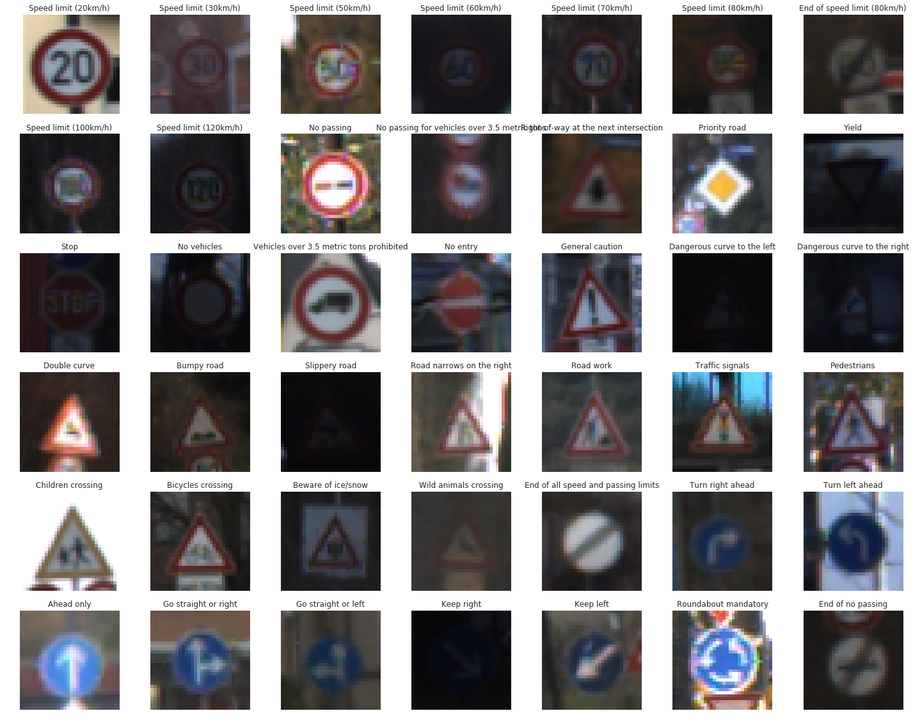
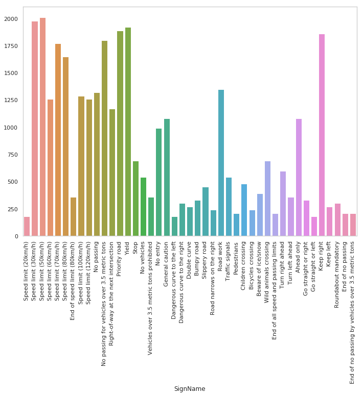
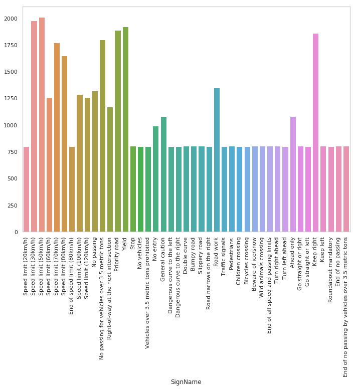
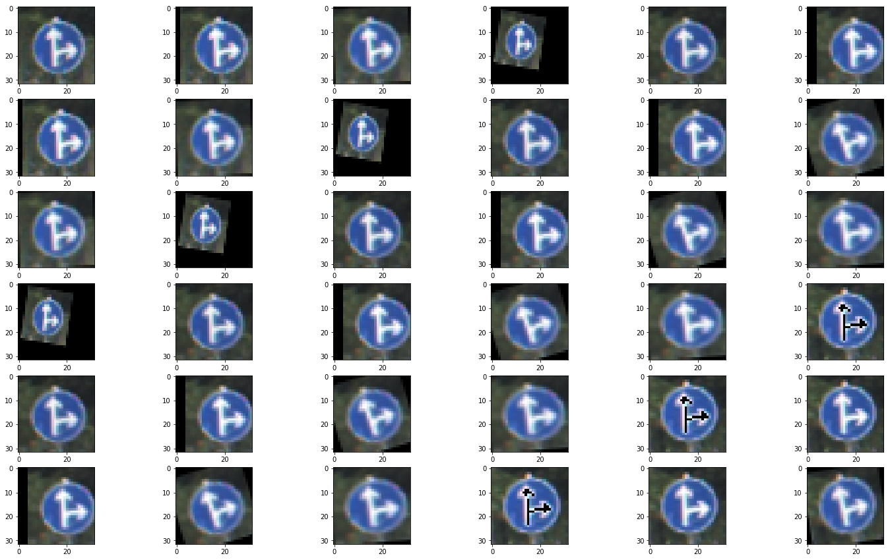
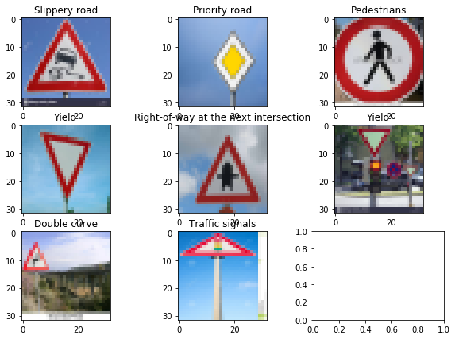

```
from google.colab import drive
drive.mount('/content/drive/')

%cd /content/drive/'My Drive'/'All_Repos'/Self-Driving-Car-NanoDegree/CarND-Traffic-Sign-Classifier-Project/
```

    Drive already mounted at /content/drive/; to attempt to forcibly remount, call drive.mount("/content/drive/", force_remount=True).
    /content/drive/My Drive/All_Repos/Self-Driving-Car-NanoDegree/CarND-Traffic-Sign-Classifier-Project


## Step 1: Dataset Summary & Exploration

The German Traffic Sign Benchmark is a multi-class, single-image classification challenge held at the International Joint Conference on Neural Networks (IJCNN) 2011. This dataset consists of color channel images of shape (32,32,3) split into train, test and validation sets. The datasets are loaded from pickle dumps of resized images. There are 43 different classes of images as shown below. 

### Load image data


```
# Load pickled data
import pickle

# TODO: Fill this in based on where you saved the training and testing data

training_file = 'dataset/train.p'
validation_file= 'dataset/valid.p'
testing_file = 'dataset/test.p'

with open(training_file, mode='rb') as f:
    train = pickle.load(f)
with open(validation_file, mode='rb') as f:
    valid = pickle.load(f)
with open(testing_file, mode='rb') as f:
    test = pickle.load(f)
    
X_train, y_train = train['features'], train['labels']
X_valid, y_valid = valid['features'], valid['labels']
X_test, y_test = test['features'], test['labels']
```

### Provide a Basic Summary of the Data Set Using Python, Numpy and/or Pandas


```
import numpy as np


### Replace each question mark with the appropriate value. 
### Use python, pandas or numpy methods rather than hard coding the results

# TODO: Number of training examples
n_train = y_train.shape[0]

# TODO: Number of validation examples
n_validation = y_valid.shape[0]

# TODO: Number of testing examples.
n_test = y_test.shape[0]

# TODO: What's the shape of an traffic sign image?
image_shape = X_train[0].shape

# TODO: How many unique classes/labels there are in the dataset.
n_classes = len(np.unique(y_train))

print("Number of training examples =", n_train)
print("Number of validation examples =", n_validation)
print("Number of testing examples =", n_test)
print("Image data shape =", image_shape)
print("Number of classes =", n_classes)
```

    Number of training examples = 34799
    Number of validation examples = 4410
    Number of testing examples = 12630
    Image data shape = (32, 32, 3)
    Number of classes = 43


## Exploratory Visualization

The plot below shows the images in the pickled data. One image from each class is shown below.


```
import pandas as pd

names = pd.read_csv('dataset/signnames.csv')
names.set_index(['ClassId'],inplace=True)
import matplotlib.pyplot as plt
fig, axs = plt.subplots(6, 7, figsize=(25, 20))
count = 0

for i in range(6):
  for j in range(7):
    axs[i][j].imshow(X_train[np.where(y_train == count)[0][0]])
    #print(names.loc[5].SignName)
    axs[i][j].set_title(names.loc[count].SignName)
    axs[i][j].set_axis_off()
    count+=1

plt.show()
```





## Unbalanced Datasets

As mentioned above, the German Traffic Signs dataset consists of 43 different classes of images. But not all classes have equal number of samples. The class names for the labels can be referenced from [signnames.csv](https://github.com/udacity/CarND-Traffic-Sign-Classifier-Project/blob/master/signnames.csv) file. 


```
import matplotlib.pyplot as plt
import pandas as pd
import numpy as np
import seaborn as sns
sns.set(rc={'figure.figsize':(11.7,8.27)})
sns.set_style("whitegrid")
df = pd.read_csv("signnames.csv")

uniques,counts = np.unique(y_train,return_counts=True)
g = sns.barplot(df.SignName,counts)
plt.xticks(rotation=90)
plt.grid(False)
plt.show()

print("The class '{0}' has the least number of samples > sample count = {1}".format(df.SignName.iloc[np.argmin(counts)], counts[np.argmin(counts)]) )
print("The class '{0}' has the maximun number of samples > sample count = {1}".format(df.SignName.iloc[np.argmax(counts)], counts[np.argmax(counts)]) )
```





    The class 'Speed limit (20km/h)' has the least number of samples > sample count = 180
    The class 'Speed limit (50km/h)' has the maximun number of samples > sample count = 2010


## Problem of unbalanced dataset

An unbalanced dataset is of concern because of two main reasons

1. If some of the classes are poorly represented in our dataset, the model doesn't get sufficient look at these samples. Hence the model tends to overfit the data to those classes that have ample representation
2. When trying to create a validation set from such an unbalanced dataset, we cannot be sure of having samples from each class if some of them have too few samples

Hence there is a need to balance the class distribution. The ideal way of balancing the dataset is collecting more data for these classes. But this is usually a time consuming and a costly exercise. An artificial way of adding more data to a class is referred to as data augmentation. 

## Augmenting Data

Data augmentation is a technique by which we build a jittered dataset by adding random perterbations to the existing dataset.  This serves two main purposes. By adding randomly peturbed images to the dataset we increase the sample count of the class and hence augment the data. Also, when a dataset does not naturally contain such random perturbations, adding them synthetically will make the model more robust to such perturbation that might be present in the test set. 

### Types of Perturbations

The augmented set is generated by perturbing the original image in several ways. In this implementation the following random perturbations are used

#### 1.  Brightness Augmentation
The image is converted to HSV color space and the value channel is multiplied by a random number that alters the image brightness. The image is then converted back to RGB and appended to the training dataset. 

#### 2. Translation 
The image is translated in x and y direction by a random integer between (0,5). Thus the new image is shifted slightly to the right and bottom due to this perturbation

#### 3. Rotation
This method , like translation, uses `cv2.warpaffine` method to rotate the original image by an angle between 0 and 20 degrees 

#### 4. Shear
Shearing an image produces the effect of capturing an image with the image sensor not being parallel to the object. This is also achieved using the `cv2.warpaffine` function by defining a shear matrix as shown below

These transformations as only applied to those classes whose count is less than 800. Thus we ensure that every class has atleast 800 samples in them and thus have considerable infuence on the model weights. 

The code block below shows how the transformations were performed. 


```

import random
import tensorflow as tf
from sklearn.utils import shuffle
import cv2
import time
import sys

def augment_brightness_camera_images(image):
    image1 = cv2.cvtColor(image,cv2.COLOR_RGB2HSV)
    random_bright = .25+np.random.uniform()
    #print(random_bright)
    image1[:,:,2] = image1[:,:,2]*random_bright
    image1 = cv2.cvtColor(image1,cv2.COLOR_HSV2RGB)
    return image1
  
  
def transforms(X_train,y_train):
  
  images,labels = X_train,y_train
  
  for i,img in enumerate(images):
    
    uniques_new,counts_new = np.unique(labels,return_counts=True)

    #print(counts_new[labels[i]])
    if counts_new[labels[i]] < 800:
      # Image Brightness
      brit_img = augment_brightness_camera_images(img).reshape(1,32,32,3)
      
      #Translation
      translation_matrix = np.float32([ [1,0,random.randint(0,5)], [0,1,random.randint(0,5)] ])
      img_translate = cv2.warpAffine(img, translation_matrix, (32, 32))      
      img_translate = img_translate.reshape(1,32,32,3)
      
      # Shear
      pts1 = np.float32([[5,5],[20,5],[5,20]])

      pt1 = 5+10*np.random.uniform()-10/2
      pt2 = 20+10*np.random.uniform()-10/2
      
      pts2 = np.float32([[pt1,5],[pt2,pt1],[5,pt2]])
      
      shear_M = cv2.getAffineTransform(pts1,pts2)     
      img_shear = cv2.warpAffine(img, shear_M, (32, 32)).reshape(1,32,32,3)
      
      #Rotation
      rotation_matrix = cv2.getRotationMatrix2D((16,16),random.randint(0,20),1)
      img_rotate = cv2.warpAffine(img, rotation_matrix, (32, 32))
      img_rotate = img_rotate.reshape(1,32,32,3)
      
      images = np.concatenate((images,np.array(brit_img)),axis=0)
      labels = np.append(labels,np.array(labels[i]).reshape(1,),axis=0)
      images = np.concatenate((images,np.array(img_translate)),axis=0)
      labels = np.append(labels,np.array(labels[i]).reshape(1,),axis=0)
      images = np.concatenate((images,np.array(img_rotate)),axis=0)
      labels = np.append(labels,np.array(labels[i]).reshape(1,),axis=0)
      images = np.concatenate((images,np.array(img_shear)),axis=0)
      labels = np.append(labels,np.array(labels[i]).reshape(1,),axis=0)      
  
  return images,labels
      
time0 = time.time()
print(X_train.shape)
X_train_new,y_train_new = transforms(X_train,y_train)
time1 = time.time()
elapsed = time1-time0
print(elapsed)
print(X_train_new.shape)


```

    (34799, 32, 32, 3)
    464.0905246734619
    (46507, 32, 32, 3)


It can be seen above for the length of the new training set that new images have been added to the dataset. Plotting the class dirstribution like before shows a much more balanced distribution compared to the raw dataset


```
import matplotlib.pyplot as plt
with open('dataset/augmented_train.p', mode='rb') as f:
    aug_dataset = pickle.load(f)
X_train = aug_dataset['X_train']
y_train = aug_dataset['y_train']

import numpy as np
import seaborn as sns
sns.set(rc={'figure.figsize':(11.7,8.27)})
sns.set_style("whitegrid")
df = pd.read_csv("signnames.csv")

uniques,counts = np.unique(y_train,return_counts=True)
g = sns.barplot(df.SignName,counts)
plt.xticks(rotation=90)
plt.grid(False)
plt.show()
```





## Pickle dump the Augmented Data


```
#aug_data = {'X_train':X_train_new, 'y_train':y_train_new}
aug_data_file = 'dataset/augmented_train.p'
with open(aug_data_file, mode='rb') as f:
    train = pickle.load(f)
```

## Augmented Data

### Translate, Rotate, Shear, Brightness 

A sample output from the augment set is shown below. The new images added to the dataset come from the random translations, rotations, shear deformations and brightness augmentation to the original image. 


```
X_train = train['X_train']
fig,axs = plt.subplots(6,6,figsize=(25,15))
for i in range(6):
  for j in range(6):
    axs[i][j].imshow(X_train[35799+(i+j)])
    
plt.show()
    
  
```





## Model Architecture

<center> </center>

The model architecture is based on [Yan LeCun's LeNet-5](http://yann.lecun.com/exdb/publis/pdf/lecun-98.pdf) architecture shown above. 

The architecture has 5 layers - 2 convolutional and 3 fully connected layers. In order to prevent the model from overfitting, a dropout layer is added between layers 3 and 4. Along with dropout, an L2 regularization is also employed to the weights of the convolution  and fully connected layers. L2 regularization helps in preventing overfitting by penalizing the larger weights. 

Below is the description of model architecture.

| Layer                 |     Description                               | 
|:---------------------:|:---------------------------------------------:| 
| Input                 | 32x32x3 input image                      | 
| Convolution 5x5       | 1x1 stride, VALID padding, outputs 28x28x16     |
| RELU                  |                                               |
| Max pooling           | 2x2 stride, outputs 14x14x16                   |
| Convolution 5x5       | 1x1 stride, VALID padding, outputs 10x10x32    |
| RELU                  |                                               |
| Max pooling           | 2x2 stride, outputs 5x5x32                    |
| Flatten               | output 800                                    |
| Drop out              |                                               |
| Fully connected       | output 240                                    |
| RELU                  |                                               |
| Fully connected       | output 84                                     |
| RELU                  |                                               |
| Fully connected       | output 43                                     |

Cross-entropy is used as the loss function. An adams optimizer is used to minimize this loss function. 

## Hyper-Parameter Tuning

CNNs have several hyper parameters that contribute to their performance. Hyper parameter tuning is an involved process that can lead to significant performance improvements. The parameters I've considered are, learning rate, number of epochs, the drop out probability and beta - the regularization parameter.

|                  |     Lerning Rate   |    Epoch     |    Keep Prob    |   Beta    |   Train Accuracy |Validation Accuracy | Test Accuracy | Comment | 
|:--------------:|:--------------------------:|:----------------:|:----------------------:|:------------:|:----------------------------------:|:-----------------------:|:-----------------------:|:-----------------------:|
|**Final Iteration**  |  **0.0006**  | **175** | **0.5** | **0.001**|**0.999** | **0.973** | **0.964** | **Best fit**
|  |   0.0006  | 50 | 0.5 | 0.001|0.998 | 0.971 | 0.956 | lower test accuracy
|  |   0.0006  | 100 | 0.5 | 0.001|0.998 | 0.963 | 0.956 | lower test accuracy
|  | 0.001  | 175 | 0.5 | 0.001| 0.996  | 0.958  | 0.951  | accuracies dropped
|  | 0.0006  | 175 | 0.6 | 0.001|0.999 | 0.968 | 0.954 | slight overfitting
|  | 0.0006  | 175 | 0.7 | 0.001|0.998 | 0.978 | 0.959 | lower test accuracy
|  | 0.0006 | 175 | 0.5 | 0.01 | 0.991 | 0.950 | 0.94 | underfitting
|  | 0.0006 | 175 | 0.5 | 0.1 | 0.925 | 0.896 | 0.905 | Very noisy ,underfitting|

## Effect of Image Normalization

The above accuracy results were obtained from a model in which the input images were inadvertantly not normalized. Normalizing the input images is a popular technique employed in deep learning and often leads to faster convergence of the model. The reason being, weight updates in a neural network happens through back propagation. During back propagation the the weights are corrected by subtracting "learning_rate * gradient" factor from the previous weight and thus takes a step towards the minima of the loss function surface. If the features are not normalized, each feature could be of a different scale and hence the gradients might be of varing scales as well.  Thus one single learning rate might not be sufficient to make the opimizer move towards the minima in all directions. This causes the convergence to be much slower. One option  would be to use a different learning rate in each direction but that increases the number of hyper-parameters that needs to be tuned and infact profibitive since the loss surface has thousands of dimensions. The effect of normalization is more pronounced in datasets which have large varations in the feature scales. 

There are several ways to normalize an input image. The two common approaches being

1. Zeroing out the mean and normalizing the variance. 

<center><a href="https://www.codecogs.com/eqnedit.php?latex=x_{norm}&space;=&space;\frac{x&space;-&space;\mu}{\sigma}" target="_blank"></a></center>

2. Normalizing by converting the bounds of the image to lie between [-1, 1]

<center><a href="https://www.codecogs.com/eqnedit.php?latex=x_{norm}&space;=&space;\frac{x&space;-&space;128.}{128.}" target="_blank"></a></center>


The normalized gray scale images after mean subtraction are shown below

<center> </center>


The image below shows the convergence with and without image normalization.

|     Non - Normalized Convergence      |    Gray Normalized Convergence  |  Color Normalized Convergence |
|:----------------------------------------------------------:|:----------------------------------------------------:|:---------------------------------------------------:|
| ||


|                  |     Lerning Rate   |    Epoch     |    Keep Prob    |   Beta    |   Train Accuracy |Validation Accuracy | Test Accuracy | Comment | 
|:--------------:|:--------------------------:|:----------------:|:----------------------:|:------------:|:----------------------------------:|:-----------------------:|:-----------------------:|:-----------------------:|
|**No Normalization**  |  **0.0004**  | **150** | **0.5** | **0.001**|**0.999** | **0.972** | **0.962** | **Best fit**
| Gray Normalized  |   0.0004  | 150 | 0.5 | 0.001|0.999 | 0.961 | 0.955 | lower test accuracy
| Color Normalized  |   0.0004  | 150 | 0.5 | 0.001|0.999 | 0.963 | 0.953 | lower test accuracy

What appears to come out from these comparisons is that the normalized images, be it gray scale or color, seem to have a smaller ramp time to reach the expected accuracy and hence a potential faster convergence. The normalized inputs start off with a validation accuracy of > 70% in both cases whereas the non normalized input starts with a validation accuracy of ~ 5% at the end of the first Epoch. But it quickly ramps up and catches up with the normalized inputs. For this dataset to reach a validation accuracy of 96% I had to run the model for at least 150 epochs. So, either approach did not have any significat difference in time.  This probably is due to the fact that although there are 43 different classes in the dataset, the images still have a comparable feature range. One noticable difference though is that the non-normalized inputs resulted in a slightly improved accuracy. Hence this implementation uses the non-normalized input approach.  Also, using the RGB color space was found to result in a slight accuracy improvement and hence the images are not converted to gray scale. 

## Evaluating the model on Web Images

8 images of German Traffic Signs were downloaded from the web. They were preprocessed to resize them to (32,32) sized images and passed to the model with the best fit. The results below shows that the model was able to predict  them well as long as the image is well curated and the traffic sign is cropped to occupy the entire image. For the last three images where the same traffic sign is just a part of the image, the predictions were not accurate and infact none of the top 5 predictions had the correct class. So, one of the limitations of the model is perhaps it doesn't account for all scales on the traffic sign. Also, warped image was also not predicted well. Perhaps, augmenting all classes , and not just the sparce classes, could be beneficial to overcome this limitation. Also, the image scales should be purturbed as part of the i


```
import os
import cv2
import numpy as np
import matplotlib.pyplot as plt

import pandas as pd

df = pd.read_csv("signnames.csv")


img_paths = os.listdir('./web_images')

images = list()
labels = np.array([23,12,27,13,11,13,21,26])
count=0

fig,axs = plt.subplots(3,3,figsize=(10,7))
count = 0
for im_pth in img_paths:

  img = cv2.imread('web_images/'+im_pth)
  img = cv2.cvtColor(img,cv2.COLOR_BGR2RGB)
  (h, w) = img.shape[:2]
  center = (w / 2, h / 2)
  img = cv2.resize(img,(32,32), interpolation = cv2.INTER_AREA)
  images.append(img)

images = np.array(images)
count = 0
for i in range(3):
  for j in range(3):
    if count < 8:
      axs[i][j].imshow(images[count])
      axs[i][j].set_title(df.SignName.iloc[labels[count]])
      count+=1
plt.show()
```





## Predict using trained model

Using the pretrained model the top-5 predictions were as shown

<center> </center>


```
!jupyter nbconvert Traffic-Sign-Classifier.ipynb --to markdown
```

    [NbConvertApp] Converting notebook Traffic-Sign-Classifier.ipynb to markdown
    [NbConvertApp] Support files will be in Traffic-Sign-Classifier_files/
    [NbConvertApp] Making directory Traffic-Sign-Classifier_files
    [NbConvertApp] Making directory Traffic-Sign-Classifier_files
    [NbConvertApp] Making directory Traffic-Sign-Classifier_files
    [NbConvertApp] Making directory Traffic-Sign-Classifier_files
    [NbConvertApp] Making directory Traffic-Sign-Classifier_files
    [NbConvertApp] Writing 15696 bytes to Traffic-Sign-Classifier.md


```

```
